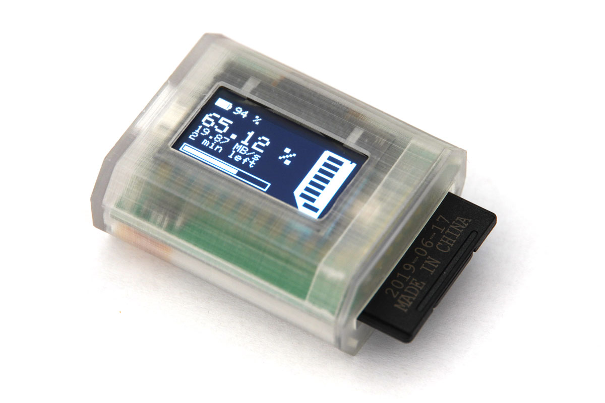
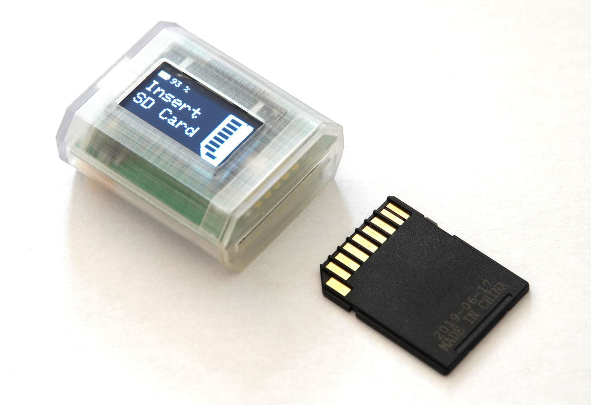
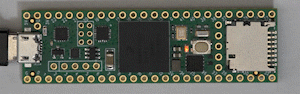
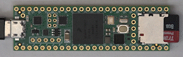
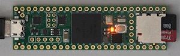
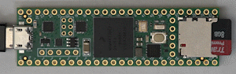

# TinyWiper

The TinyWiper is a small, battery powered device which securely deletes your SD cards by overwriting the whole card with randomly generated data.  

> *Note:* this is an successor project to the [SDCardWiper](https://github.com/gpinvestigativ/SDCardWiper) Project, which is based on a Raspberry Pi Zero and readily available parts.  

**Did you know?** Just formating your SD card does not delete its contents, it just makes them invisible within the filebrowser of your operating system. Special forensic software can often easily reconstruct data on deleted or formated SD cards.  

If you want to make sure that your data can not be reconstructed, this device will securely erase your SD cards.

## Hardware

* Teensy 4.0 as MCU
* Custom PCB
* 128x64 I2C OLED Display
* Full Size SD Card Slot
* 400 mAh Lipo Battery ~ 2h battery life
* Mirco USB for fimware update & battery charging
* Hardware on/off switch
* 3D printed case

## Software

* True random number generator used to initialize PRNG
* automatically detect SD card, start wiping automatically after timeout
* every Nth 512byte Block, generate a new random buffer (for speedup purposes currently every 10th block)
* keep track of successfully written blocks, try to re-write failed blocks at the end
* format card after wiping
* shows successrate at the end of the process

# DIY Version
Part of the reason there is a custom PCB for the TinyWiper was, that at the time of development only the Teensy4.0 was available which had it's high speed SDIO pins at a very DIY inconvenient place.  
Recently the Teensy4.1 was released which conveniently has a micro SD card slot. Therefore I decided to make a compatible firmware for the T4.1 for people who want to build a quick DIY version of the TinyWiper. You can find this firmware in the *t41port* branch.

## Setup

LED pattern | meaning 
---|---
 | Idle - insert SD card
 | wiping - 10% done 
 | wiping - 80% done 
 | wiping finished - remove sd card

## Q&A

*Q: Why not use a secure erase software on a computer like the security options within macs disk manager?*  
A: While it is totaly viable to use secure erase software options for this task, the TinyWiper has 3 major advantages:
* TinyWiper is highly portable. You can carry it in your pocket in the field and use it standalone without having to use a computer.
* Securely wiping SD cards is time consuming. It easily blocks the sd card slot on your computer for several hours. Overwriting a 64GB SD card can take between 1-2 hours, 400GB multiple hours.
* Software that runs on your computer can much easier be infiltrated by a virus or an attacker. The TinyWiper is an unteathered device, which makes it impossible to hack without physical access to it.
